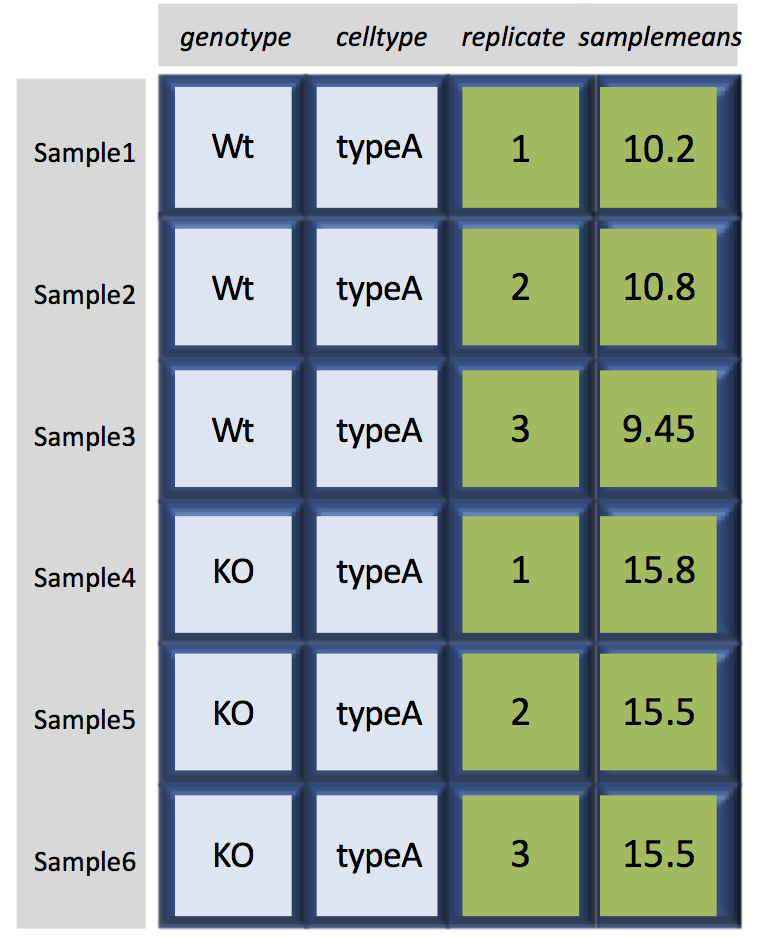

Approximate time: 60 min

## Learning Objectives

* Demonstrate how to subset, merge, and create new datasets from existing data structures in R.
* Export data tables and plots for use outside of the R environment.

### Dataframes

Dataframes (and matrices) have 2 dimensions (rows and columns), so if we want to select some specific data from it we need to specify the "coordinates" we want from it. We use the same square bracket notation but rather than providing a single index, there are *two indices required*. Within the square bracket, **row numbers come first followed by column numbers (and the two are separated by a comma)**. Let's explore the `metadata` dataframe, shown below are the first six samples:

<p align="center">

</p>

For example:

```r
# Extract the element from the first row in the first column
metadata[1, 1]   

# Extract the element from the second row in the 3rd column
metadata[2, 3]   
```

Now if you only wanted to select entire rows, you would provide the index for the rows and leave the columns index blank. The key here is to include the comma, to let R know that you are accessing a 2-dimensional data structure:

```r
# Extract all elements in the 3rd row
metadata[3, ]    
```

**What is the data structure of the output?**

If you were selecting specific columns from the data frame - the rows are left blank:

```r
# Extract all elements in the 3rd column
metadata[ , 3]    
```

Just like with vectors, you can select multiple rows and columns at a time. Within the square brackets, you need to provide a vector of the desired values:	

```r
# Extract the first two columns
metadata[ , 1:2] 

# Extract the first, third and sixth rows of the first and third columns
metadata[c(1,3,6), c(1,3)] 
```

**What is the data structure of the output?**

For larger datasets, it can be tricky to remember the column number that corresponds to a particular variable. (Is `celltype` in column 1 or 2?). In some cases, the column number for a variable can change if the script you are using adds or removes columns. It's therefore often better to use column names to refer to a particular variable, and it makes your code easier to read and your intentions clearer.

```r
# Extract the elements of the celltype column corresponding to the first three samples
metadata[1:3 , "celltype"] 
```


You can do operations on a particular column, by selecting it using the `$` sign using the column name. In this case, the entire column is a vector. For instance, to extract all the genotypes from our dataset, we can use: 

```r
# Extract genotype column using $ notation
metadata$genotype 
```

You can use `colnames(metadata)` or `names(metadata)` to remind yourself of the column names. We can then supply index values to select specific values from that vector. For example, if we wanted the genotype information for the first five samples in `metadata`:

```r
# Check the column names of the dataframe
colnames(metadata)

# Extract the first 5 elements of the genotype column
metadata$genotype[1:5]
```

The `$` allows you to select a single column by name. To select multiple columns by name, you need to concatenate a vector of strings that correspond to column names: 

```r
# Extract multiple columns from the dataframe using column names
metadata[, c("genotype", "celltype")]
```

```r
          genotype celltype
sample1        Wt    typeA
sample2        Wt    typeA
sample3        Wt    typeA
sample4        KO    typeA
sample5        KO    typeA
sample6        KO    typeA
sample7        Wt    typeB
sample8        Wt    typeB
sample9        Wt    typeB
sample10       KO    typeB
sample11       KO    typeB
sample12       KO    typeB
```

While there is no equivalent `$` syntax to select a row by name, you can select specific rows using the row names. To remember the names of the rows, you can use the `rownames()` function:

```r
# Check the row names of the metadata dataframe
rownames(metadata)

# Extract multiple rows from a dataframe using row names
metadata[c("sample10", "sample12"),]
```

#### Selecting using indices with logical operators

With dataframes, similar to vectors, we can use logical vectors for specific columns in the dataframe to select only the rows in a dataframe with TRUE values at the same position or index as in the logical vector. We can then use the logical vector to return all of the rows in a dataframe where those values are TRUE (or NA).

```r
# Check which celltype values are equal to typeA
metadata$celltype == "typeA"

# Save the output T/F values to a variable
idx <- metadata$celltype == "typeA"

# Extract the rows of the metadata which are TRUE (or NA)
metadata[idx, ]
```

##### Selecting indices with logical operators using the `which()` function

As you might have guessed, we can also use the `which()` function to return the indices for which the logical expression is TRUE. For example, we can find the indices where the `celltype` is `typeA` within the `metadata` dataframe:

```r
# Check the row positions for which celltype values are equal to typeA
which(metadata$celltype == "typeA")

# Save the output indices to a variable
idx <- which(metadata$celltype == "typeA")

# Extract the rows of the metadata which are TRUE
metadata[idx, ]
```

Or we could find the indices for the metadata replicates 2 and 3:

```r
# Determine which rows have replicate values > 1
idx <- which(metadata$replicate > 1)

# Extract the corresponding rows	
metadata[idx, ]
```

Let's save this output to a variable:

```r
# Extract the corresponding rows and save to a variable
sub_meta <- metadata[idx, ]
```

***

**Exercise**  

Subset the `metadata` dataframe to return only the rows of data with a genotype of `KO`.
	
***

#### Extracting rows using filter()

There are easier methods for subsetting the rows of **dataframes** using logical expressions, including the `filter()` and `subset()` functions. These functions will return the rows of the dataframe for which the logical expression is TRUE, allowing us to subset the data in a single step. We will explore the `filter()` function in more detail.

```r
# Extract the rows of the dataframe with genotype of `KO`
filter(metadata, genotype == "KO")

# Extract the rows with celltype of typeB
filter(metadata, celltype == "typeB")
```

The `filter()` function can be quite handy, though it won't replace all instances of requiring the `[]`, such as for filtering columns in a dataframe or for extracting values in a vector.

### Lists

Selecting components from a list requires a slightly different notation, even though in theory a list is a vector (that contains multiple data structures). To select a specific component of a list, you need to use double bracket notation `[[]]`. Let's use the `list1` that we created previously, and index the second component:

```r
# Extract the 2nd component
list1[[2]]
```

What do you see printed to the console? Using the double bracket notation is useful for **accessing the individual components whilst preserving the original data structure.** When creating this list we know we had originally stored a dataframe in the second component. With the `class` function we can check if that is what we retrieve:

```r
# Extract and save to a variable
comp2 <- list1[[2]]

# Check the class of the variable
class(comp2)
```

### Writing to file 

Everything we have done so far has only modified the data in R; the files have remained unchanged. Whenever we want to save our datasets to file, we need to use a `write` function in R. 

To write our matrix to file in comma separated format (.csv), we can use the `write.csv` function. There are two required arguments: the variable name of the data structure you are exporting, and the path and filename that you are exporting to. By default the delimiter is set, and columns will be separated by a comma:

```r
# Save dataframe to csv file
write.csv(sub_meta, file="data/subset_meta.csv")
```

Similar to reading in data, there are a wide variety of functions available allowing you to export data in specific formats. Another commonly used function is `write.table`, which allows you to specify the delimiter you wish to use. This function is commonly used to create tab-delimited files.

> **NOTE:** Sometimes when writing a dataframe with row names to file, the column names will align starting with the row names column. To avoid this, you can include the argument `col.names = NA` when writing to file to ensure all of the column names line up with the correct column values.

Writing a vector of values to file requires a different function than the functions available for writing dataframes. You can use `write()` to save a vector of values to file. For example:

```r
# Save vector to file
write(glengths, file="data/genome_lengths.txt", ncolumns=1)
```

***

> ### An R package for data wrangling
> With the exception of `filter()`, the methods presented above are using base R functions for data wrangling. The **Tidyverse suite of packages** was specifically designed to make data wrangling easier. The `filter()` function is from the Tidyverse, and we have [additional materials](https://hbctraining.github.io/Training-modules/Tidyverse_ggplot2/lessons/intro_tidyverse.html) available for exploration of these tools.

---

*This lesson has been developed by members of the teaching team at the [Harvard Chan Bioinformatics Core (HBC)](http://bioinformatics.sph.harvard.edu/). These are open access materials distributed under the terms of the [Creative Commons Attribution license](https://creativecommons.org/licenses/by/4.0/) (CC BY 4.0), which permits unrestricted use, distribution, and reproduction in any medium, provided the original author and source are credited.*

* *The materials used in this lesson are adapted from work that is Copyright © Data Carpentry (http://datacarpentry.org/). 
All Data Carpentry instructional material is made available under the [Creative Commons Attribution license](https://creativecommons.org/licenses/by/4.0/) (CC BY 4.0).*
