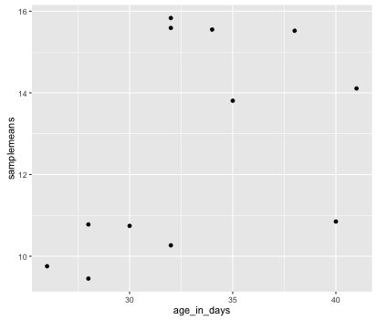
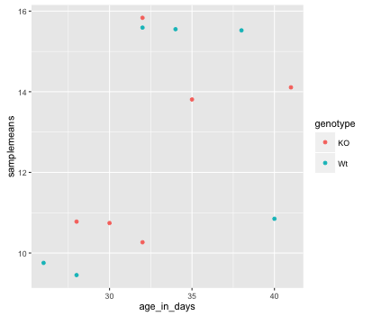
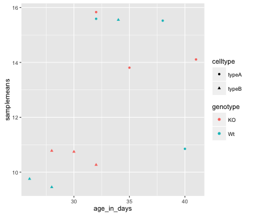
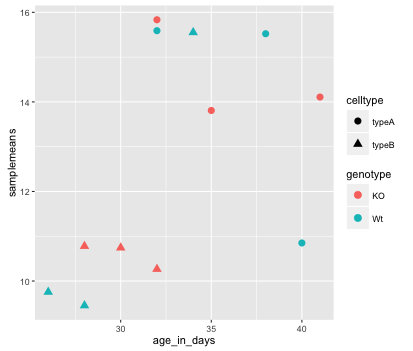
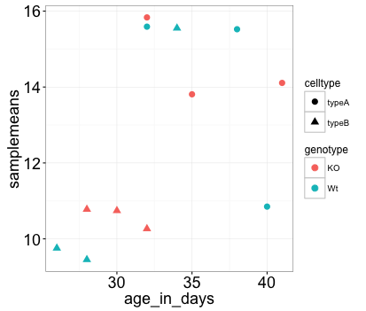

Approximate time: 60 minutes

## Learning Objectives 

* Plot graphs using the external package "ggplot2".
* Use the "map" function for iterative tasks on data structures.
* Export plots for use outside of the R environment.

## Setting up a data frame for visualization

In this lesson we want to make a basic scatter plot with average expression in each sample on one axis and the age of the mouse on the other axis. When we make the plots, we also want to use all the metadata available to appropriately annotate the plots. 

Let's take a look at the metadata table and check what information we already have.

```r
View(metadata)
```

Looks like we are missing information about the age of each of the mouse samples; let us add an additional metadata column to `metadata`.

```r
# Create a numeric vector with ages. Note that there are 12 elements here since there are 12 rows in metadata dataframe
age_in_days <- c(40, 32, 38, 35, 41, 32, 34, 26, 28, 28, 30, 32)    

# Add the new vector as the last column to the metadata dataframe
metadata <- cbind(metadata, age_in_days)    
```

We are now ready for plotting and data visualization!

## Data Visualization with `ggplot2`

When we are working with large sets of numbers it can be useful to display that information graphically to gain more insight. Visualization deserves an entire course of its own (there is that much to know!). In this lesson we will be plotting with the popular package [`ggplot2`](http://docs.ggplot2.org/).

More recently, R users have moved away from base graphic options towards `ggplot2` since it offers a lot more functionality as compared to the base R plotting functions. The `ggplot2` syntax takes some getting used to, but once you get it, you will find it's extremely powerful and flexible. We will start with drawing a simple x-y scatterplot of `samplemeans` versus `age_in_days` from the `metadata` data frame. `ggplot2` assumes that the input is a  data frame.

Let's start by loading the `ggplot2` library, you downloaded and installed this library as part of the `tidyverse` package.

```r
library(ggplot2)
```

The `ggplot()` function is used to **initialize the basic graph structure**, then we add to it. The basic idea is that you specify different parts of the plot, and add them together using the `+` operator. These parts are often referred to as layers.

Let's start: 

```r
ggplot(metadata) # what happens? 
```

You get an blank plot, because you need to **specify layers** using the `+` operator.

One type of layer is **geometric objects**. These are the actual marks we put on a plot. Examples include:

* points (`geom_point`, `geom_jitter` for scatter plots, dot plots, etc)
* lines (`geom_line`, for time series, trend lines, etc)
* boxplot (`geom_boxplot`, for, well, boxplots!)

For a more exhaustive list on all possible geometric objects and when to use them check out [Hadley Wickham's RPubs](http://rpubs.com/hadley/ggplot2-layers) or the [RStudio cheatsheet](https://www.rstudio.com/wp-content/uploads/2016/11/ggplot2-cheatsheet-2.1.pdf). 

A plot **must have at least one `geom`**; there is no upper limit. You can add a `geom` to a plot using the `+` operator

```r
ggplot(metadata) +
  geom_point() # note what happens here
```

You will find that even though we have added a layer by specifying `geom_point`, we get an error. This is because each type of geom usually has a **required set of aesthetics** to be set. Aesthetic mappings are set with the aes() function and can be set inside `geom_point()` to be specifically applied to that layer. If we supplied aesthetics within `ggplot()`, they will be used as defaults for every layer. Examples of aesthetics include:

* position (i.e., on the x and y axes)
* color ("outside" color)
* fill ("inside" color) 
* shape (of points)
* linetype
* size

To start, we will add position for the x- and y-axis since `geom_point` requires the most basic information about a scatterplot, i.e. what you want to plot on the x and y axes. All of the others mentioned above are optional.

```r
ggplot(metadata) +
     geom_point(aes(x = age_in_days, y= samplemeans))
```

  


Now that we have the required aesthetics, let's add some extras like color to the plot. We can **`color` the points on the plot based on genotype**, by specifying the column header. You will notice that there are a default set of colors that will be used so we do not have to specify. Also, the **legend has been conveniently plotted for us!**


```r
ggplot(metadata) +
  geom_point(aes(x = age_in_days, y= samplemeans, color = genotype)) 
```

  

Alternatively, we could color based on celltype by changing it to `color =celltype`. Let's try something different and have both **celltype and genotype identified on the plot**. To do this we can assign the `shape` aesthetic the column header, so that each celltype is plotted with a different shaped data point. Add in `shape = celltype` to your aesthetic and see how it changes your plot:

```r
ggplot(metadata) +
  geom_point(aes(x = age_in_days, y= samplemeans, color = genotype,
  			shape=celltype)) 
```

  


The **size of the data points** are quite small. We can adjust that within the `geom_point()` layer, but does **not** need to be **included in `aes()`** since we are specifying how large we want the data points, rather than mapping it to a variable. Add in the `size` argument by specifying a number for the size of the data point:

```r
ggplot(metadata) +
  geom_point(aes(x = age_in_days, y= samplemeans, color = genotype,
  			shape=celltype), size=3.0) 
```

 
  

The labels on the x- and y-axis are also quite small and hard to read. To change their size, we need to add an additional **theme layer**. The ggplot2 `theme` system handles non-data plot elements such as:

* Axis label aesthetics
* Plot background
* Facet label backround
* Legend appearance

There are built-in themes we can use (i.e. `theme_bw()`) that mostly change the background/foreground colours, by adding it as additional layer. Or we can adjust specific elements of the current default theme by adding the `theme()` layer and passing in arguments for the things we wish to change. Or we can use both.

Let's add a layer `theme_bw()`. Do the axis labels or the tick labels get any larger by changing themes?

```r
ggplot(metadata) +
  geom_point(aes(x = age_in_days, y= samplemeans, color = genotype,
  			shape=celltype), size=3.0) +
  theme_bw() 
```

Not in this case. But we can add arguments using `theme()` to change it ourselves. Since we are adding this layer on top (i.e later in sequence), any features we change will override what is set in the `theme_bw()`. Here we'll **increase the size of the axes labels and axes tick labels to be 1.5 times the default size.** When modfying the size of text we often use the `rel()` function. In this way the size we specify is relative to the default (similar to `cex` for base plotting). We can also provide the number vaue as we did with the data point size, but can be cumbersome if you don't know what the default font size is to begin with. 

```r
ggplot(metadata) +
  geom_point(aes(x = age_in_days, y= samplemeans, color = genotype,
  			shape=celltype), size=3.0) +
  theme_bw() +
  theme(axis.text = element_text(size=rel(1.5)),
  		axis.title = element_text(size=rel(1.5)))			
```
 
 
 

> *NOTE:* You can use the `example("geom_point")` function here to explore a multitude of different aesthetics and layers that can be added to your plot. As you scroll through the different plots, take note of how the code is modified. You can use this with any of the different geometric object layers available in ggplot2 to learn how you can easily modify your plots! 

> *NOTE:* RStudio provide this very [useful cheatsheet](https://www.rstudio.com/wp-content/uploads/2016/11/ggplot2-cheatsheet-2.1.pdf) for plotting using `ggplot2`. Different example plots are provided and the associated code (i.e which `geom` or `theme` to use in the appropriate situation.)


***

**Exercise**

1. The current axis label text defaults to what we gave as input to `geom_point` (i.e the column headers). We can change this by **adding additional layers** called `xlab()` and `ylab()` for the x- and y-axis, respectively. Add these layers to the current plot such that the x-axis is labeled "Age (days)" and the y-axis is labeled "Mean expression".
2. Use the `ggtitle` layer to add a title to your plot. *NOTE: Useful code to center your title over your plot can be done using `theme(plot.title=element_text(hjust=0.5))`.*

***

> *NOTE:* If you wanted to change plot colors you would add another layer `scale_fill_manual()` to the code, and within the function specify which colors you want to use using the `values` argument.  For example, if the factor column you are coloring with has 2 levels, you will need to give 2 values as follows `scale_fill_manual(values=c("purple","orange"))`.
>
> *NOTE:* You are not restricted to colors specified as above, you have the choice of a lot of colors using their *hexadecimal code*, [click here for more information about color palettes in R](http://www.cookbook-r.com/Graphs/Colors_(ggplot2)/).

## Exporting figures to file

There are two ways in which figures and plots can be output to a file (rather than simply displaying on screen). The first (and easiest) is to export directly from the RStudio 'Plots' panel, by clicking on `Export` when the image is plotted. This will give you the option of `png` or `pdf` and selecting the directory to which you wish to save it to. It will also give you options to dictate the size and resolution of the output image.

The second option is to use R functions and have the write to file hard-coded in to your script. This would allow you to run the script from start to finish and automate the process (not requiring human point-and-click actions to save).  In R’s terminology, **output is directed to a particular output device and that dictates the output format that will be produced**.  A device must be created or “opened” in order to receive graphical output and, for devices that create a file on disk, the device must also be closed in order to complete the output. We are not going to do this in class, but you can find more information in the note below.

> Let's print our scatterplot to a pdf file format. First you need to initialize a plot using a function which specifies the graphical format you intend on creating i.e.`pdf()`, `png()`, `tiff()` etc. Within the function you will need to specify a name for your image, and the with and height (optional). This will open up the device that you wish to write to:
> ```r
> pdf("figures/scatterplot.pdf")
> ```
> 
> If you wish to modify the size and resolution of the image you will need to add in the appropriate parameters as arguments to the function when you initialize. Then we plot the image to the device, using the ggplot scatterplot that we just created. 
> 
> ```r
> ggplot(metadata) +
>   geom_point(aes(x = age_in_days, y= samplemeans, color = genotype,
>   			shape=celltype), size=rel(3.0)) 
> ```
> 
> Finally, close the "device", or file, using the `dev.off()` function. There are also `bmp`, `tiff`, and `jpeg` functions, though the jpeg function has proven less stable than the others. 
>   			
> ```r    
> dev.off()
> ```
> 
> ***Note 1:*** *You will not be able to open and look at your file using standard methods (Adobe Acrobat or Preview etc.) until you execute the `dev.off()` function.*
> 
> ***Note 2:*** *If you had made any additional plots before closing the device, they will all be stored in the same file; each plot usually gets its own page, unless you specify otherwise.*


---
*This lesson has been developed by members of the teaching team at the [Harvard Chan Bioinformatics Core (HBC)](http://bioinformatics.sph.harvard.edu/). These are open access materials distributed under the terms of the [Creative Commons Attribution license](https://creativecommons.org/licenses/by/4.0/) (CC BY 4.0), which permits unrestricted use, distribution, and reproduction in any medium, provided the original author and source are credited.*
